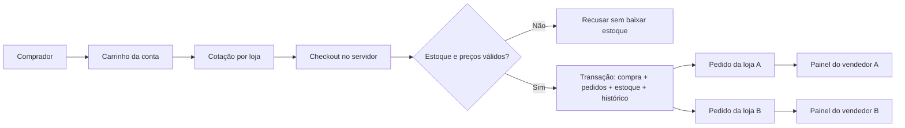
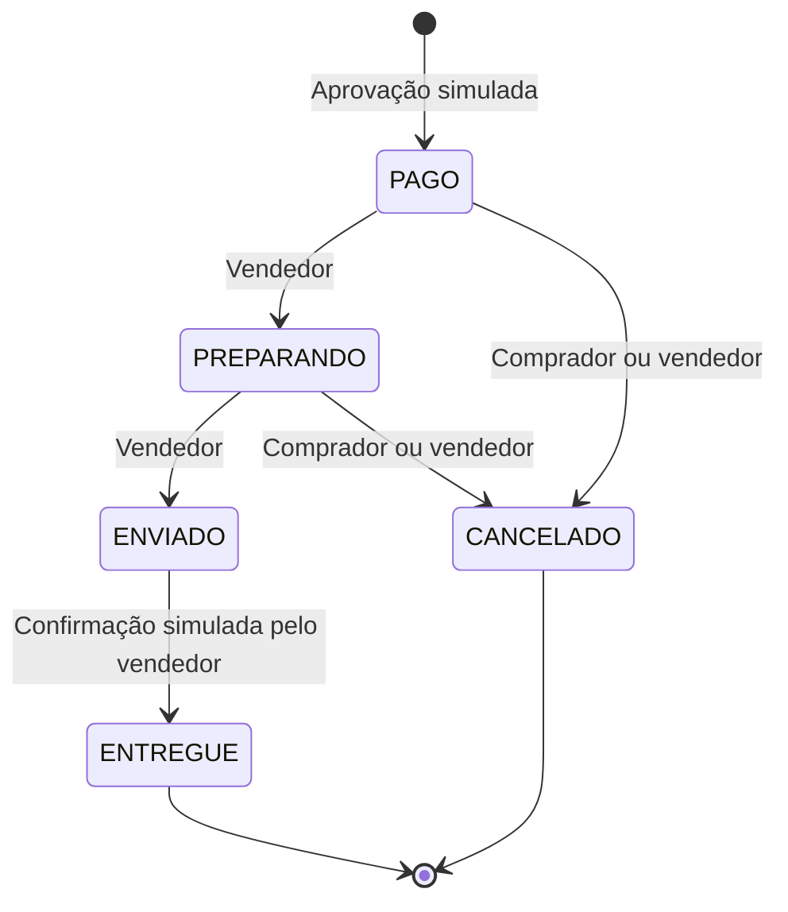

# Como a Órbita está organizada

## Percurso de uma compra

`Compra` representa o checkout completo. `Pedido` continua representando a parte de uma empresa. O frete pertence ao pedido da loja. `ItemPedido` guarda uma cópia do nome, imagem, preço e quantidade no momento da compra; editar o anúncio não muda o histórico da compra.

## Dinheiro e concorrência

O catálogo usa centavos inteiros. Quantidades, preço e frete são calculados no servidor; o comprador envia uma cotação que permite detectar alterações entre a revisão e a confirmação. O total máximo da demonstração é limitado para caber nos campos inteiros.

O checkout usa uma transação `Serializable`. Cada baixa exige `estoque >= quantidade`; se qualquer produto falhar, todas as baixas e gravações são desfeitas. Conflitos do PostgreSQL são repetidos até três vezes; persistindo o conflito, a API pede nova tentativa.

Cada checkout recebe uma chave UUID gerada pela interface. A combinação de conta e chave é única no banco. Repetir a confirmação devolve a compra já criada, inclusive se a primeira resposta tiver se perdido.

O cancelamento verifica o comprador ou a loja responsável, o estado anterior e a transição permitida. A alteração de status, o histórico, o estorno e a reposição de estoque acontecem juntos. O banco aceita somente um estorno por pedido.

## Contas e navegador

Uma conta tem papel comprador ou vendedor. A conta vendedora se relaciona com uma `Empresa`; uma compradora não recebe empresa fictícia. Os `Usuario` originais permanecem na API JWT legada.

`SessaoNavegador` recebe um token aleatório de 256 bits. Só seu SHA-256 é salvo no banco. O navegador recebe o token em cookie `HttpOnly`, `SameSite=Lax`, persistente por 30 dias e com `Secure` quando `NODE_ENV=production`.

`PerfilConectado` associa as contas autenticadas à sessão. Trocar de perfil exige que a conta já esteja nessa associação. Cadastro/login renovam o token da sessão. Remover um perfil encerra seu acesso naquele navegador. Sair de todos encerra essa sessão. Trocar a senha remove as associações daquela conta nos demais navegadores e renova a sessão atual.

Alterações exigem um cabeçalho próprio da aplicação, uma origem permitida quando o navegador envia `Origin` e o identificador esperado da conta. O servidor confere esse identificador com a sessão antes de executar a operação. Essas medidas acompanham cookies com `SameSite`; nenhuma credencial fica em Web Storage.

## Interface e dados

O React Router identifica a página; as páginas privadas passam por `AccessGate`. Isso organiza a experiência, enquanto a autorização real continua no servidor.

O TanStack Query mantém o resultado das chamadas HTTP. Chaves privadas incluem o ID da conta. Trocar de perfil limpa as consultas privadas e remonta a página, descartando formulários do perfil anterior. A sessão é consultada novamente ao recuperar foco; uma alteração enviada por uma aba desatualizada é recusada pelo backend.

As páginas são carregadas sob demanda. Fontes e imagens iniciais estão no projeto. O upload valida formato e tamanho, remove metadados ao converter para WebP e usa nome UUID gerado no servidor.

## Continuidade com a Central de Pedidos

A migration nova adiciona tabelas e campos. Os pedidos e itens anteriores continuam válidos, sem compra associada. O autor de um histórico passa a poder ser um `Usuario` legado ou uma `Conta` do marketplace, com uma restrição SQL exigindo exatamente um deles.

Os estados antigos continuam existindo para os pedidos antigos. O marketplace usa seus novos estados por rotas próprias. Valores antigos não foram recalculados; possíveis inconsistências históricas continuam sendo assunto separado.
