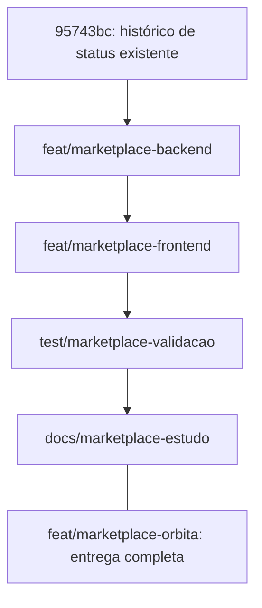

# Branches da entrega Órbita

O trabalho foi separado em quatro branches por assunto. Elas são encadeadas: cada uma parte da anterior e acrescenta seu próprio commit. Isso preserva as dependências entre banco, API, interface e testes.

A branch **`feat/marketplace-orbita`** reúne a entrega completa e é o ponto indicado para abrir o site e continuar o desenvolvimento.

| Ordem | Branch                       | Commit da entrega  | O que foi acrescentado                                                                                                                                                                                                                                |
| ----- | ---------------------------- | ------------------ | ----------------------------------------------------------------------------------------------------------------------------------------------------------------------------------------------------------------------------------------------------- |
| 1     | `feat/marketplace-backend`   | `f01bc5e`          | Banco e migration, contas e sessões com vários perfis, catálogo, lojas, carrinho, checkout por vendedor, estoque, cancelamento/estorno, upload e testes de integração da API. Inclui compatibilidade com a API anterior e correções nas dependências. |
| 2     | `feat/marketplace-frontend`  | `0919a60`          | Interface React com identidade Órbita, catálogo e filtros, produto, autenticação, troca de perfis, carrinho, checkout, compras e painel do vendedor. Inclui imagens/fontes locais, acessibilidade e layouts para desktop e celular.                   |
| 3     | `test/marketplace-validacao` | `912d420`          | Playwright, axe, bancos isolados para testes de navegador, GitHub Actions, Prettier e comandos de desenvolvimento/build/testes na raiz.                                                                                                               |
| 4     | `docs/marketplace-estudo`    | Ponta desta branch | README, uso das contas demonstrativas, arquitetura, créditos, registro de validação, plano de estudo e este mapa de branches.                                                                                                                         |



## Consultar o que mudou

```powershell
git log --oneline --decorate -5 feat/marketplace-orbita
git show --stat feat/marketplace-backend
git show --stat feat/marketplace-frontend
git show --stat test/marketplace-validacao
git show --stat docs/marketplace-estudo
```

Cada mensagem de commit inclui uma descrição mais detalhada do respectivo bloco. As descrições das branches também foram registradas na configuração local do Git; este documento permite consultá-las junto com o projeto.

Para usar a versão completa:

```powershell
git switch feat/marketplace-orbita
npm run dev
```

As branches anteriores, incluindo `main` e `feat/resumo-pedidos`, mantêm suas pontas originais. Não houve publicação de branches no remoto nesta organização. As pastas locais de skills e seu arquivo de controle, que já estavam sem rastreamento antes da implementação, ficaram fora dos commits da Órbita.
